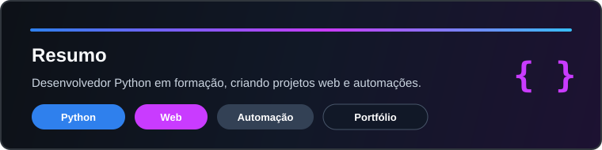

  

<h1 align="center">Oi, eu sou Daniel Finotti</h1>

  

  
  
  
  
  

---

## Sobre mim

- Faço Python e estou evoluindo em lógica, automação e projetos web.
- Atualmente cursando tecnologia e desenvolvimento de software.
- Gosto de transformar ideias em sistemas simples, bonitos e funcionais.
- Estou sempre praticando, testando coisas novas e melhorando meu portfólio.

## Projeto em destaque

<table>
  <tr>
    <td width="65%">
      <h3>Perfil GitHub</h3>
      

        Projeto com visual dark, animações e foco em apresentação profissional
        para mostrar minha evolução com Python, web e tecnologia.
      

      

        <strong>Status:</strong> em desenvolvimento 
        <strong>Foco:</strong> Python, portfólio e identidade visual
      

    </td>
    <td width="35%">
      
    </td>
  </tr>
</table>

## Tecnologias

  
  
  
  
  
  

## Agora estudando

  
  
  

## Estatísticas

  

## Onde me encontrar

  Meu espaço principal para projetos e estudos:

- GitHub: `https://github.com/danielfinotti2-spec`
- Portfólio: `https://euodeene.shop/`
- Email: `danielfinotti2@gmail.com`

---

  <strong>Obrigado pela visita ao meu perfil.</strong>

